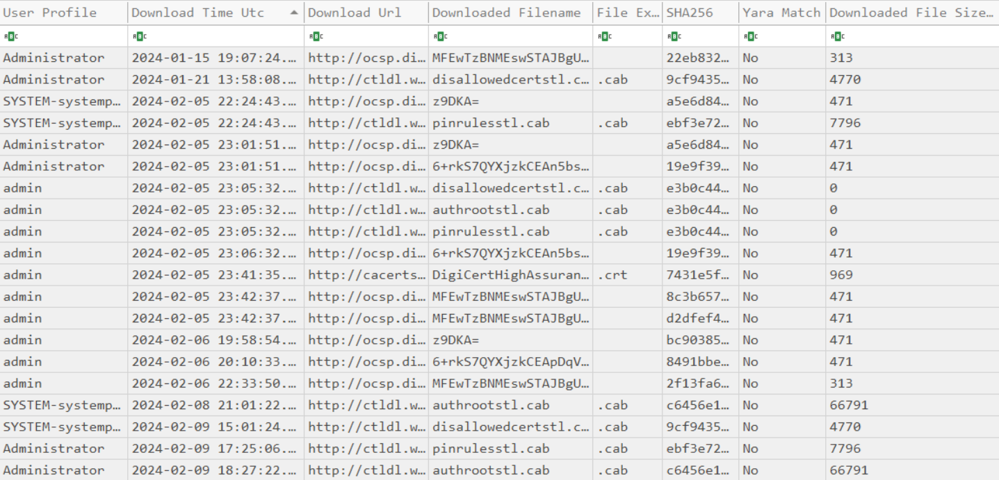

# Certutil Cache Parser

Certutil Cache Reporter is a Windows forensic utility that analyzes **CryptnetUrlCache** artifacts created by `certutil.exe`. The standalone tool enumerates cache entries across all user profiles, extracts download metadata, correlates downloaded content, calculates cryptographic hashes, performs optional YARA scanning, and exports the results to a CSV report for digital forensic investigations, incident response, and threat hunting.


---
## Purpose
This tool can be deployed during live system analysis or on a full disk image in most real incident response cases. The CryptnetUrlCache artifacts often survive even when other evidence has been removed or is unavailable- event logs were cleared, downloaded files were deleted, threat actor cannot be attributed. 


## Features

* Enumerates CryptnetUrlCache artifacts for:

  * Standard user profiles
  * SYSTEM profile
* Supports:

  * Live Windows systems
  * Mounted forensic images
  * Offline Windows directories
* Parses Cryptnet metadata to extract:

  * Download URL
  * Download timestamp (UTC & Local)
  * HTTP Last-Modified header
  * HTTP ETag
  * Downloaded file size
* Correlates metadata with cached content files
* Calculates:

  * MD5
  * SHA-1
  * SHA-256
* Detects common file types
* Optional YARA scanning

  * Automatically downloads YARA if not supplied
  * Automatically downloads YARA Forge Core rules if not supplied
  * Supports custom YARA executables
  * Supports custom rule directories
  * Supports disabling YARA completely
* Generates a comprehensive CSV report
* Displays real-time progress and scan statistics

---

## Requirements

* Windows
* .NET 8 Runtime 


---

## Usage

```text
CertutilCacheReporter.exe [options]
```

### Options

| Option             | Description                                           |
| ------------------ | ----------------------------------------------------- |
| `-d <WindowsRoot>` | Windows installation root (default: `C:\`)            |
| `-o <Output>`      | Output directory or CSV filename                      |
| `-e <YaraExe>`     | Path to `yara.exe` or `yara64.exe`                    |
| `-r <RulesDir>`    | Path to a directory containing `.yar` / `.yara` files |
| `--no-yara`        | Disable YARA download and scanning                    |
| `-h`, `--help`     | Show help                                             |

---

## Examples

### Scan the local system

```cmd
CertutilCacheReporter.exe
```

---

### Scan a mounted forensic image

```cmd
CertutilCacheReporter.exe -d D:\
```

---

### Save report to a custom directory (Can also be a UNC network share)

```cmd
CertutilCacheReporter.exe -o C:\Reports
```

---

### Specify the report filename

```cmd
CertutilCacheReporter.exe -o C:\Reports\Case001.csv
```

---

### Use a custom YARA executable (for sandboxed analysis environments)

```cmd
CertutilCacheReporter.exe -e C:\Tools\yara64.exe
```

---

### Use custom YARA rules (for sandboxed analysis environments)

```cmd
CertutilCacheReporter.exe -r C:\Rules
```

---

### Use custom YARA executable and rules directory with one or multiple .yar or .yara files

```cmd
CertutilCacheReporter.exe -e C:\Tools\yara64.exe -r C:\Rules
```

---

### Disable YARA scanning (much faster depending on rulesets)

```cmd
CertutilCacheReporter.exe --no-yara
```

---

## CSV Output



The generated report includes information such as:

* User/Profile
* Download Time (UTC)
* Download URL
* Downloaded Filename
* File Extension
* SHA-256, SHA-1, MD5 hashes of downloaded file
* YARA Match (yes/no)
* Matching YARA Rules (I/A)
* Downloaded File Size in bytes
* Cache Key
* HTTP ETag
* HTTP Last-Modified (Last modification time reported by the web server for the downloaded resource. May provide insight into when the resource was last updated but should not be considered authoritative.)
* File Type
* Content Exists
* Content Path
* Metadata Path
* Error Information

---

## Automatic Downloads

If no YARA executable is specified, the tool automatically downloads the latest supported Windows x64 YARA release. If no rules directory is specified, the tool automatically downloads the latest YARA Forge Core rules. Both are cached locally and reused on future executions.

---

## Credits

YARA rules:

* YARA Forge (https://yarahq.github.io/)

---

## License

MIT License.
